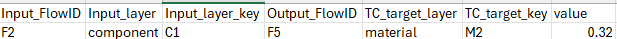
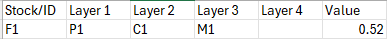

# User guide – Recovery Model

*author: Harmjan de Vries*

*Date: 21-11-2024*

## Introduction

This document contains instructions for how to use the recovery model and documents the input data format used by the model.

The recovery model is designed to compute material flows for a system with multiple layers of resources – e.g. elements are contained in materials, materials are contained in components, components are contained in products. The model computes the flows for each of these different levels.

To use the recovery model to compute flows, three different CSV files must be provided: compositions, transfer coefficients and inflows. These must all be served in CSV format within the same folder. Running the model is very simple:

1. Create a folder for your data, and create a sub-folder called ‘input_data’.
2. Collect the compositions, TCs and inflows files within the ‘input_data’ folder, adhering to the file names and column definitions outlined below.
3. Go to the ‘run_model.py’ file, and modify the variable ‘data_folder’ to specify the path to your data. If your layer names are different from ‘product’,’component’, ‘material’ and ‘element’, specify the layers used.
4. Execute the python file

Below is an outline of the input format required for the TCs, compositions and inflows.

## Transfer Coefficients

**Filename**: ‘TCs.csv’

**Columns**:

- (Optional) Year: Year to which this TC belongs
- (Optional) Scenario: Scenario to which this TC belongs
- (Optional) Location: Location to which this TC belongs
- (Optional) additionalSpecification: additionalSpecification for this TC
- Input_FlowID: Stock/Flow ID of the input flow for this TC
- Input_layer: Layer to which the input resource belongs, e.g. product, component, material
- Input_layer_key: Input resource
- Output_FlowID: Stock/Flow ID of the output flow for this TC
- TC_target_layer: Layer to which the output resource belongs
- TC_target_key: Output resource
- value: Value of the TC

**Example**:

Above entry to the TC table indicates that 32% of material M2 that is embedded in component C1 is preserved between flow F2 and F5.

**NOTE**: The user can also use an asterisk to specify that they want to use the same TC for all products in a layer, for example by using ‘P\*’ as the input layer key to denote that this TC applies to all input products.

## Compositions

**Filename**: ‘composition.csv’

**Columns**:

- (Optional) Year: Year to which this composition data point belongs
- (Optional) Scenario: Scenario to which this composition data point belongs
- (Optional) Location: Location to which this composition data point belongs
- (Optional) additionalSpecification: additionalSpecification for this data point
- Stock/ID: Stock/Flow ID for the flow the material is contained in
- Layer 1, Layer 2, Layer 3, Layer 4: Layer for which this composition data point specifies composition
- Value: Composition value, denoting what percentage of the rightmost resource composes the resource to the left of it.

**Example**:

Above entry to the composition table indicates that material M1 composes 52% of component C1, if component C1 is contained within product P1.

## Inflows

**Filename**: ‘inputs.csv’

**Columns**:

- (Optional) Year: Year for this inflow
- (Optional) Scenario: Relevant scenario for this inflow
- (Optional) Location: Location for this inflow
- (Optional) additionalSpecification: additionalSpecification for this inflow
- Stock/Flow ID: Stock/Flow ID for this inflow
- Substance_main_parent: Inflow substance. Must be a substance of the highest level layer, the parent substance.
- Value: Amount of this substance contained in the inflow. The model is agnostic to the unit used in this entry, but the same unit must be handled consistently across inflows

**NOTE:** The inflows file is leading for the model to choose which years, scenarios, locations and additionalSpecification will be analyzed. Specifying these is optional, you can specify some or all of these columns. If a specific year/scenario/.. is specified in the inflows file, the model will search for these same years/scenarios/.. in the TCs and composition files and use these if they are present. If these are not present in the TCs or composition files, we assume that the TCs and composition files are the same for all years/scenarios/locations.
